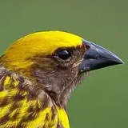

# Baya

> Baya is a HDL (*Hardware Description Language*) targeting FPGAs that I develop in my spare time as a hobby.

 

This project stems from my desire to learn and explore the following three concepts in greater depth:
- Rust language
- Compiler design
- FPGA programming

Obviously, since it is a hobby project, it has no intention of competing with Verilog/VHDL.

## Goals

My primary goal is to **learn**. There is no intention of turning this project into anything professional.

## Resources

The three main resources I’m using for this project are:
- the book [Engineering A Compiler](https://openlibrary.org/books/OL37337164M/Engineering_a_Compiler)
- the book [Getting Started With FPGAs](https://openlibrary.org/books/OL40165947M/Getting_Started_with_FPGAs)
- the book [The Rust Programming Language](https://doc.rust-lang.org/stable/book/)

The logo is a cropped version of a photo of a Baya weaver, a bird known for building impressively complex nests. The original photo was taken by Hari Patibanda, can be found [here](https://s3.animalia.bio/animals/photos/full/original/1280px-a-male-baya-weaver-assessing-the-competition-285017302060729.webp) and is available under the CC BY-SA 4.0 (Attribution-ShareAlike 4.0 International) license.